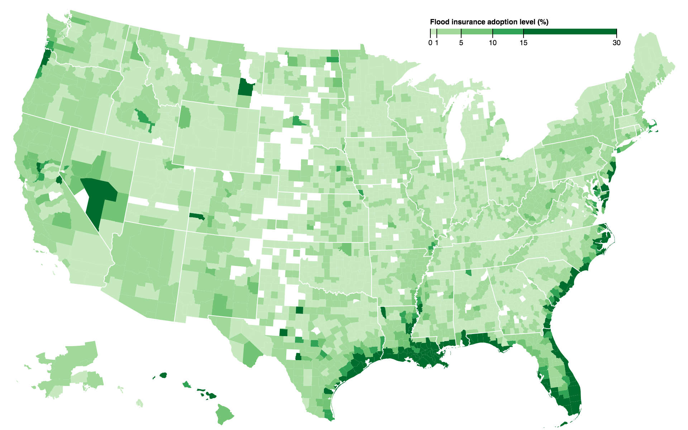
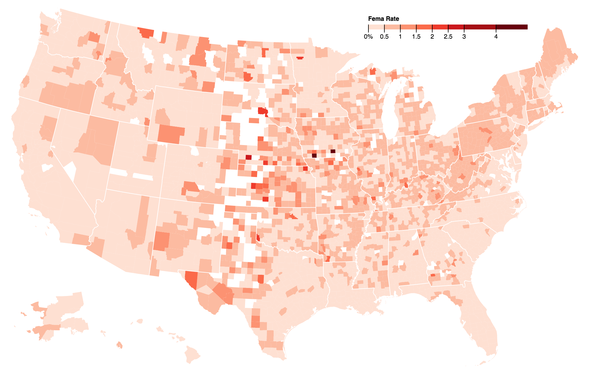

"_Floods are the most common and costly natural hazard in the nation._" ([source: fema.gov](https://www.fema.gov/wildfires-you-need-flood-insurance)). 

This project estimates the impact of prices and geographic (long/lat) location on insurance adoption rates. Estimates are obtained using regression and also using a **blend of random forest based estimation with linear regression.** 
[Brief writeup](https://optimalbrew.blogspot.com/2018/10/flood-insurance-coverage-and-rates.html)

* [mapping and estimating elasticity of insurance adoption](./femaData.ipynb) 

[D3 version of the maps](https://bl.ocks.org/petecarkeek/7b46a24f7f1cb1a0f5b59cf59b615713) on blocks.org. 
